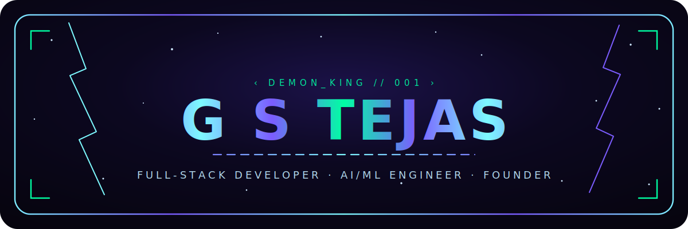
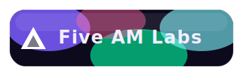
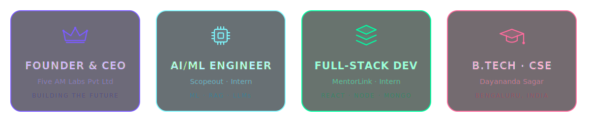
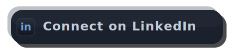

<!-- ════════════════════════  G S TEJAS · PROFILE README  ════════════════════════ -->

<div align="center">

<a href="https://gs-tejas-hub.github.io/Demon-s-Portfolio/" title="Visit my portfolio">
  
</a>

<br/>


<br/>

<a href="https://www.linkedin.com/in/g-s-tejas-10580929a/"></a>
<a href="https://instagram.com/the_demon_king_001_"></a>
<a href="https://5am-labs.vercel.app/"></a>
<a href="https://gs-tejas-hub.github.io/Demon-s-Portfolio/"></a>
<a href="mailto:gudur.tejasgs@gmail.com"></a>


[](https://github.com/GS-Tejas-hub?tab=followers)

</div>


## ⚡ whoami

```typescript
const tejas: Developer = {
  name:      "G S Tejas",
  alias:     "the_demon_king_001",
  role:      "Full-Stack Dev × AI/ML Engineer × Founder",
  education: "B.Tech CSE @ Dayananda Sagar Institutions",
  location:  "Bengaluru, Karnataka, India 🇮🇳",
  company:   "Five AM Labs Pvt Ltd  (CEO & Founder)",
  currently: ["AI/ML @ Scopeout", "Full-Stack @ MentorLink", "Building StartupKit"],
  stack:     ["JavaScript", "TypeScript", "React", "Node", "Python", "AI/ML"],
  mantra:    "Always coding, gaming, building with AI & innovating 🚀",
};
```

> 🗡️ Motivated full-stack web developer and AI/ML engineer with **2+ years** of hands-on experience,
> shipping scalable web apps, training intelligent models, and turning startup ideas into real products.
> Coordinator of the **E-Cell @ DSU**, an IEEE-published researcher, and a relentless builder who believes
> tech should make a *real-world* impact. **Collaborations welcome, if they're meaningful 🤝**


## 🛠️ What Keeps Me Busy

<div align="center">



</div>


## ⚔️ Tech Arsenal

<div align="center">


<br/><br/>

**🧠 AI / ML &nbsp;·&nbsp; ⚙️ Automation**


</div>


## 🌌 Featured Projects

<table>
<tr>
<td width="50%" valign="top">

### 🕊️ SoulNest
AI-powered emotional healing platform that preserves memories of loved ones and offers personalized companionship, anytime, anywhere.

`React 19` &nbsp;`Three.js` &nbsp;`GSAP` &nbsp;`TypeScript`

[](https://soulnest.club)
[](https://github.com/GS-Tejas-hub/SoulNest.Club)

</td>
<td width="50%" valign="top">

### 🧠 Scopeout


AI/ML engineering on a real product: retrieval-augmented generation, LLM integration and model fine-tuning.

`Python` &nbsp;`RAG` &nbsp;`LLMs` &nbsp;`Fine-tuning`

[-00C2FF?style=flat-square)](https://scopeout-b9b80.web.app/home)

</td>
</tr>
<tr>
<td width="50%" valign="top">

### 🤝 MentorLink


Full-stack work across a mentoring platform and a B2G incubation ERP for running startups, sessions, pitching events and funding programs.

`React` &nbsp;`Node` &nbsp;`MongoDB`

[](https://mentorlink.in)
[](https://partner.mentorlink.in/en/landing)
[](https://bitbucket.org/mentorlink21/workspace/overview/)

</td>
<td width="50%" valign="top">

### 🚀 StartupKit
The founder OS for India. A local-first, encrypted, offline-first mobile app to plan, manage and run your startup end to end.

`Expo` &nbsp;`React Native` &nbsp;`TypeScript`

[](https://github.com/GS-Tejas-hub/startupkit)

</td>
</tr>
</table>

<details>
<summary><b>More work samples</b> &nbsp;<i>(click to expand)</i></summary>

<br/>

<table>
<tr>
<td width="50%" valign="top">

### 🏠 Estox
Real-estate investment platform for discovering, tracking and investing in property opportunities.

`Web App`

[](https://www.estox.in/home)

</td>
<td width="50%" valign="top">

### 🌱 Greonomy AI
AI-driven sustainable manufacturing solutions that help businesses cut waste and operate greener.

`AI` &nbsp;`Sustainability`

[](https://greonomy.ai/)

</td>
</tr>
<tr>
<td width="50%" valign="top">

### 🎓 DSU Website
Official Dayananda Sagar University website. An ongoing build currently in progress.

`Web App` &nbsp;`Ongoing`

[](https://8660401238.vercel.app)

</td>
<td width="50%" valign="top">

### ⚖️ LegalEasy
The advocate's office on your screen: case vault, hearing tracker, client crew, court hub and an AI assistant. Built for web and mobile.

`Next.js` &nbsp;`React Native` &nbsp;`TypeScript`

[](https://legalezi.com/)
[](https://github.com/hyperzen1320/LegalEasy)
[](https://github.com/hyperzen1320/LegalEasyMobileApp)

</td>
</tr>
</table>

</details>


## 📊 GitHub Stats

<div align="center">


<br/>


<br/><br/>


</div>


## 🏆 Beyond the Code

- 🧠 **IEEE Researcher:** co-authored *RAGClin*, a privacy-preserving RAG framework, presented at **ICERECT-2025** (IEEE Bangalore Section)
- 🚀 **E-Cell Coordinator @ DSU:** kickstarted the Entrepreneurship-Cell; we now run our own incubation
- 🎮 **ACE Gamer & Demon King:** competitive at heart, creative by craft
- 📸 **Photographer:** 3+ years capturing events, portraits and stories
- 🏅 **Linux Foundation Certified** (Infosys Springboard) · scored **82%** (12th) and **86%** (10th)
- 🗣️ Speaks **English · Hindi · Kannada · Telugu · Tamil**


<div align="center">

## 🤝 Let's Build Something Meaningful

I take on **web & AI/ML projects through my company, [Five AM Labs](https://5am-labs.vercel.app/)**.
If it's meaningful, let's make it happen.

<a href="https://www.linkedin.com/in/g-s-tejas-10580929a/"></a>
<a href="https://instagram.com/the_demon_king_001_"></a>
<a href="https://5am-labs.vercel.app/"></a>
<a href="mailto:gudur.tejasgs@gmail.com"></a>

<br/>


***⭐ From [GS-Tejas-hub](https://github.com/GS-Tejas-hub) · built with code, AI & a little chaos 😈***

</div>
